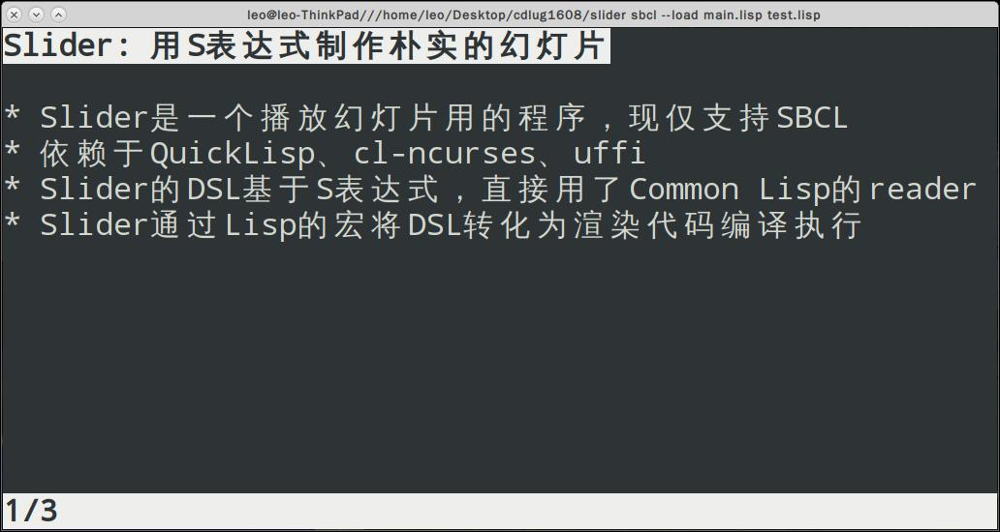

README.md
=========

Load a file(test.lisp): `sbcl --load main.lisp test.lisp`

Key:

* j: next
* k: previous
* R: reload
* q: quit

Dependency:
* sbcl
* Quicklisp
* cl-ncurses(libncursesw.so.5)
* uffi

